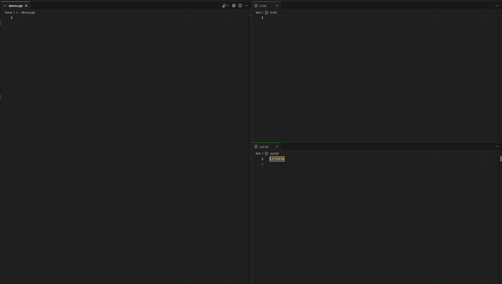

# 各配置详解

## for Windows

> [!WARNING]
>
> 使用前请确保各语言插件已下好，并要下载Auto Debug 插件

### normal 版本配置

- 基本的输入输出重定向
- 各语言配置
- 配合页面合理布局，可以有不错的写算法题体验

### linux-normal 版本

- 基本如上

### AutoGit 版本

鸣谢zqy同学提供想法

- 可以在此基础上加入自动化git功能

## for Linux

### 对于两个配置

只需把配置中所有".exe"删除，将所有"\\"换成"/"即可

## 布局样例

